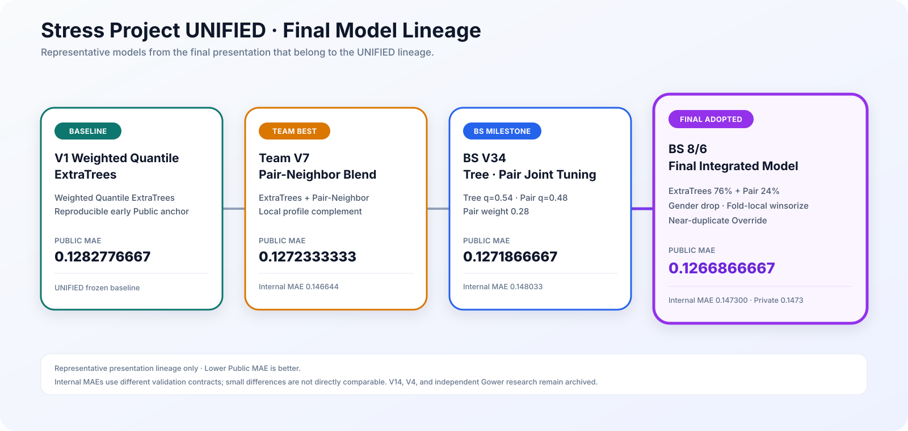

<div align="center">

# 🧠 Stress Score Prediction — UNIFIED

### 스트레스 지수 예측 프로젝트 · 팀 최종 결과와 모델 계보

<p>
  
  
  
</p>

**Task:** 건강·생활 정형 데이터 기반 `stress_score` 회귀  
**Role:** 팀 최종 결과 · 모델 계보 · provenance hub

</div>

## 최종 결과

| 항목 | 결과 |
|---|---:|
| 평가 지표 | MAE — 낮을수록 우수 |
| 최종 채택 모델 | **BS 8/6 — ExtraTrees + Pair-Neighbor** |
| 내부 검증 MAE | **0.147300** |
| Public MAE | **0.1266866667** |
| Private MAE | **0.1473** |
| 최종 블렌드 | **ExtraTrees 76% + Pair-Neighbor 24%** |

**채택 기준:** Public 단독 최적화 제외 · 내부 검증 · Private 결과 · 재현 가능한 실행 계약  
**Fresh V6:** Public `0.1265` · 동등 수준 검증 기록 부재 · 미채택

**Canonical Notebook**  
[`stress_project_BS/8_6/stress_prediction_combined_final_0806_1.ipynb`](https://github.com/thisisstress/stress_project_BS/blob/main/8_6/stress_prediction_combined_final_0806_1.ipynb)

## 모델 계보

<p align="center">
  
</p>

| 단계 | 모델 | 내부 MAE | Public MAE | 역할 |
|---|---|---:|---:|---|
| V1 | Weighted Quantile ExtraTrees | `0.147505` | `0.1282776667` | 초기 기준점 |
| V7 | Pair-Neighbor Blend | `0.146644` | `0.1272333333` | 국소 유사성 결합 |
| V34 | Tree·Pair Joint Tuning | `0.148033` | `0.1271866667` | 최종 통합 직전 후보 |
| **BS 8/6** | **Final Integrated Model** | **`0.147300`** | **`0.1266866667`** | **최종 채택** |

**OOF 비교 주의:** 실험별 split · seed · 전처리 계약 차이. 미세 MAE 차이의 직접 순위화 제외.

## 최종 모델

```text
Fold-local preprocessing
        ↓
row-level derived features
        ↓
ExtraTrees 1,200 trees · Q54  ─┐
                               ├─ 76:24 blend
Pair-Neighbor 8 features       │
28 pairs · Q48              ───┘
        ↓
near-duplicate override (< 0.2)
        ↓
round to 0.01 · clip [0, 1]
```

**Tree branch:** ExtraTrees · 1,200 trees · Q54  
**Pair branch:** 8 features · 28 pairs · Q48  
**Blend:** `76:24`  
**Tree input:** `gender` 제외  
**Winsorization:** `mean_working` · 이완기 혈압 · 콜레스테롤 · 혈당 / Fold-Train 기준  
**Derived features:** BMI · 맥압 · 평균동맥압 · 혈압 비율 · 콜레스테롤/혈당 비율 · 결측치 수

## 관련 연구 저장소

| Repository | 범위 |
|---|---|
| [`stress_project_BS`](https://github.com/thisisstress/stress_project_BS) | 최종 BS 8/6 · ExtraTrees/Pair-Neighbor |
| [`stress_project_JH`](https://github.com/thisisstress/stress_project_JH) | V7 Pair-Neighbor · 재현 코드 |
| `stress_project_SK` | 대안 모델 · UQC/Gower · 강건성 검증 |

**SK boundary:** 팀 최종 모델과 별도 연구축. 공식 발표 기준은 UNIFIED + BS 8/6.

## Reference

- [`docs/leaderboard.md`](docs/leaderboard.md) — 제출 점수 · 대표 계보
- [`docs/baseline_v1.md`](docs/baseline_v1.md) — V1 기준 모델
- [`docs/current_champion_v7.md`](docs/current_champion_v7.md) — V7 계보 이정표
- [`experiments/registry.csv`](experiments/registry.csv) — 실험 registry

**Data boundary:** 원본 `train.csv` · `test.csv` · 정답 레이블 미포함.

## License, attribution and citation

**Public view · no public reuse license.**  
팀 제작 코드·문서·원본 도식은 All Rights Reserved. 별도 서면 허가 없는 재사용·수정·재배포 불가.

공동 저자와 역할: [AUTHORS.md](AUTHORS.md) · 권리 범위와 제3자 자료: [LICENSE](LICENSE) · [LICENSE_SCOPE.md](LICENSE_SCOPE.md)  
인용 정보: [`CITATION.cff`](CITATION.cff)
